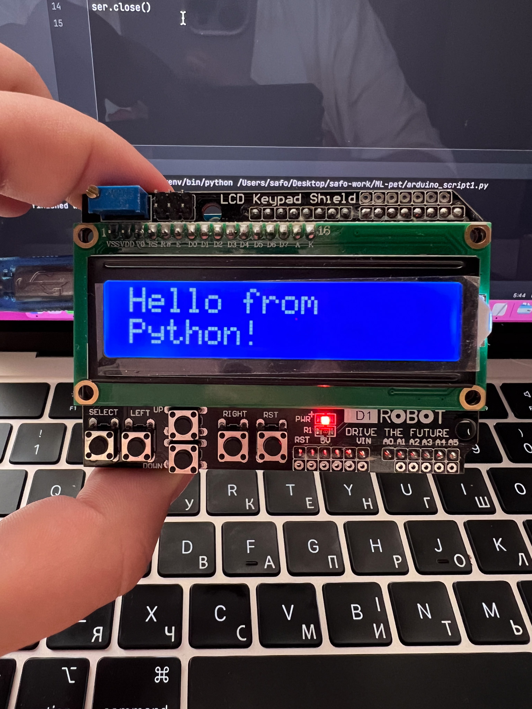

# ML-pet
Project for learning purpose with Python + Arduino UNO 
+ LCD Keypad Shield 1602

https://arduino.ua/prod235-lcd-keypad-shield
Connection: RS - 8 pin, RW - 11 pin, Enable - 9 pin, DB4-7 - 4, 5, 6, 7.

# Key Features:

**- Easy Arduino Connection:** Allows users to quickly connect to an Arduino device via specified port and baud rate.

**- LED Control:** Offers functionality to toggle individual LEDs, turn off specific LEDs, and shut down all LEDs.

**- LCD Integration:** Provides methods to send messages to an LCD screen, including splitting messages across lines and clearing the LCD display.

**- Efficient Message Sending:** Introduces delays to ensure stable communication between Python and Arduino without overloading the buffer.

**- Flexible Configuration:** Default port values are provided for both LED controller and LCD, but they can be changed when initializing the classes.

# Usage:
Simply run the provided script. 
The program will initialize your default camera (or webcam) and start detecting hand gestures. 
Recognized gestures will be displayed on the screen, on an LCD if connected, 
and will also interact with LEDs to provide a count of open fingers.